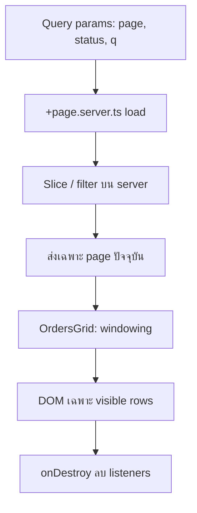
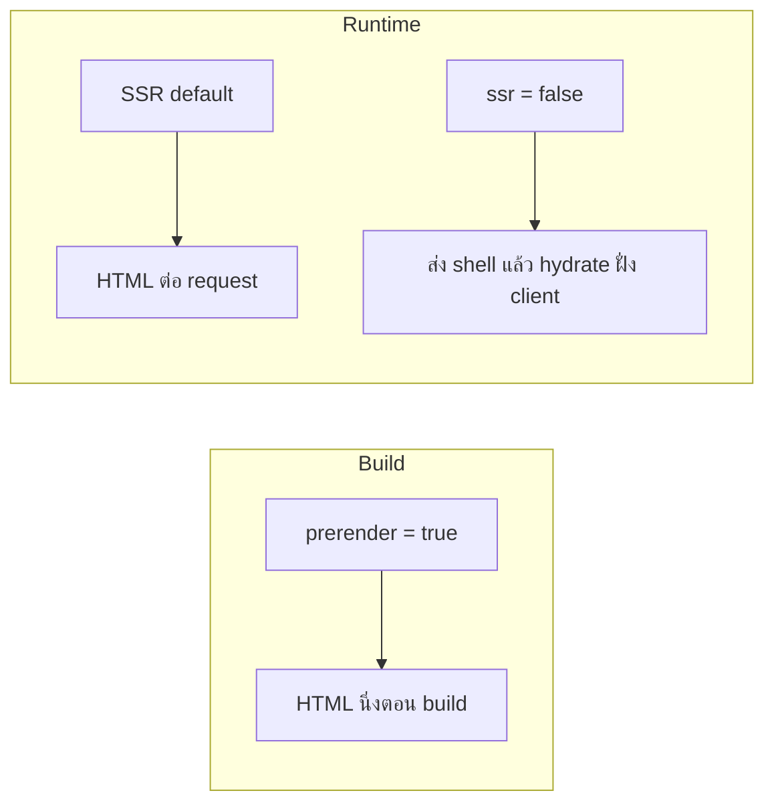
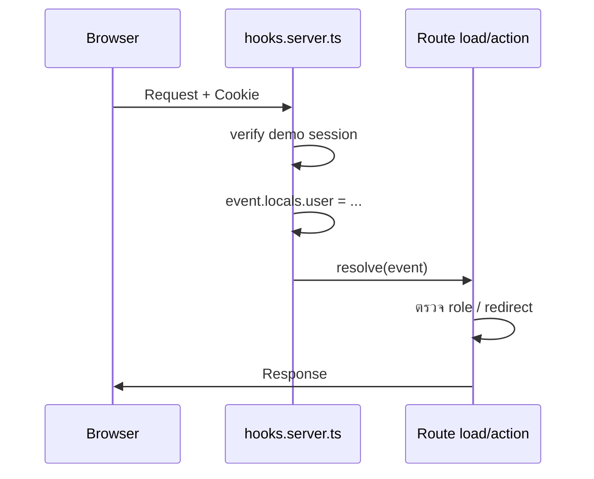

# Level 3 — Expert: Performance, Rendering Strategies & Enterprise Ops

เป้าหมายระดับนี้: คิดและสร้างแอป SvelteKit แบบ **principal architect** — ตารางข้อมูลมหาศาลยังลื่น, เลือก SSR/SSG/SPA ต่อ route ได้ถูกต้อง, และวาง Hooks + JWT/RBAC + cache/ORM ให้ปลอดภัยและวัดผลได้

> ระดับนี้สมมติว่าคุณผ่าน Intermediate แล้ว (Stores, `load`, Form Actions, `.server.ts`)

---

## สารบัญ

1. [Performance Tuning at Scale](#1-performance-tuning-at-scale)
2. [Rendering Strategies & Adapters](#2-rendering-strategies--adapters)
3. [Advanced Operations — Hooks, Hydration, Cache, ORM](#3-advanced-operations--hooks-hydration-cache-orm)
4. [Best Practices สรุประดับ Expert](#4-best-practices-สรุประดับ-expert)
5. [Checklist ก่อนขึ้น Production](#5-checklist-ก่อนขึ้น-production)
6. [ตัวอย่างและ Lab](#6-ตัวอย่างและ-lab)

---

## 1. Performance Tuning at Scale

### 1.1 ปัญหาจริงของ Data Grid มหาศาล

เมื่อตารางมีหลักพัน–หลักหมื่นแถว สิ่งที่พังก่อนไม่ใช่ “Svelte ช้า” แต่คือ:

| ต้นเหตุ                                             | อาการ                   | แนวทาง                               |
| --------------------------------------------------- | ----------------------- | ------------------------------------ |
| สร้าง DOM ทุกแถว                                    | scroll กระตุก, TTI สูง  | **Windowing / Virtualization**       |
| filter/sort ทุก keystroke บน array ใหญ่ใน `$effect` | CPU spike               | ใช้ `$derived` + debounce ฝั่ง input |
| เก็บทั้ง dataset บน client โดยไม่จำเป็น             | memory สูง              | paginate / stream จาก server         |
| listener / interval ไม่ destroy                     | memory leak ค่อย ๆ สะสม | `onDestroy` เสมอ                     |
| Tailwind class ที่สร้าง DOM หนักโดยไม่จำเป็น        | layout thrash           | ตารางแบบ fixed row height            |

```
┌──────────────────────────────────────────────────────┐
│ Viewport (เช่น สูง 480px)                            │
│ ┌────────────────────────────────────────────────┐  │
│ │ spacer บน (scrollTop → แถวที่ข้ามไป)           │  │
│ ├────────────────────────────────────────────────┤  │
│ │ แถวที่มองเห็นจริง ๆ ~15–25 แถว (+ overscan)   │  │
│ ├────────────────────────────────────────────────┤  │
│ │ spacer ล่าง (แถวที่เหลือ)                       │  │
│ └────────────────────────────────────────────────┘  │
└──────────────────────────────────────────────────────┘
  ▲
  scrollTop + rowHeight → startIndex / endIndex
```

แนวคิด windowing แบบ manual (สอนในตัวอย่าง ไม่ต้องพึ่ง lib หนัก):

```ts
const ROW_HEIGHT = 40;
const OVERSCAN = 5;

let scrollTop = $state(0);
let viewportHeight = $state(480);

const start = $derived(Math.max(0, Math.floor(scrollTop / ROW_HEIGHT) - OVERSCAN));
const end = $derived(
  Math.min(rows.length, Math.ceil((scrollTop + viewportHeight) / ROW_HEIGHT) + OVERSCAN),
);
const visible = $derived(rows.slice(start, end));
```

> **กฎ:** ถ้า row height ไม่คงที่ virtualization ซับซ้อนขึ้นมาก — สำหรับ ops console ให้ใช้ความสูงคงที่ก่อน

ดูตัวอย่าง: [`examples/01-data-grid-performance/`](./examples/01-data-grid-performance/)

### 1.2 ปรับ Reactivity ให้ถูกชั้น (Svelte 5 Runes)

```
$state → แหล่งความจริง (mutable)
$derived → ค่าคำนวณจาก state (pure, ไม่มี side effect)
$effect → side effect เท่านั้น (DOM, network, subscribe)
```

**ผิดแบบที่เจอบ่อยใน grid:**

```svelte
<!-- ❌ filter ใน $effect แล้ว set state อีกตัว = double work + risk loop -->
let filtered = $state([]);
$effect(() => {
 filtered = orders.filter((o) => o.status === status);
});
```

**ถูก:**

```svelte
<!-- ✅ -->
const filtered = $derived(orders.filter((o) => o.status === status));
```

เมื่อ filter แพงจริง (หมื่นแถว + คำค้นซับซ้อน):

1. ทำ **server-side filter/pagination** ใน `+page.server.ts` ก่อน
2. client ทำแค่ windowing บนหน้าปัจจุบัน
3. debounce ค่าค้นหา 150–300ms ก่อน `goto` / invalidate

### 1.3 Memory Leaks ที่ทีม Expert ต้องกัน

| แหล่ง leak                                                | วิธีกัน                                        |
| --------------------------------------------------------- | ---------------------------------------------- |
| `addEventListener` ใน `onMount`                           | คืนค่า cleanup หรือ `onDestroy(() => remove…)` |
| `setInterval` / `requestAnimationFrame`                   | clear ใน destroy                               |
| subscribe store / WebSocket                               | unsubscribe ใน destroy                         |
| เก็บ reference ของ DOM node / large array ใน module scope | อย่า cache ถาวรโดยไม่มี eviction               |

```svelte
<script lang="ts">
  import { onMount, onDestroy } from 'svelte';

  let el: HTMLElement | undefined = $state();

  onMount(() => {
    const onScroll = () => { /* ... */ };
    el?.addEventListener('scroll', onScroll, { passive: true });
    return () => el?.removeEventListener('scroll', onScroll);
  });

  // หรือใช้ onDestroy แยกเมื่อ cleanup มาจากหลายแหล่ง
</script>
```

### 1.4 Tailwind กับตารางใหญ่

ใช้ utility ที่ถูกและคงที่ — ธีม **slate + teal/emerald** (หลีกเลี่ยง purple default ของ AI):

- container: `bg-slate-950 text-slate-100`
- header: `bg-slate-900 border-b border-slate-700 text-teal-300`
- row hover: `hover:bg-slate-800/80`
- accent: `bg-teal-600` / `text-emerald-400`

หลีกเลี่ยงการสร้างแถวด้วย card ซ้อน card — ตาราง ops ควรเป็น flat table + sticky header

### 1.5 สรุป Performance Pipeline



---

## 2. Rendering Strategies & Adapters

SvelteKit ให้เลือก **ต่อ route** ได้ว่าจะ SSR, prerender (SSG), หรือ SPA-like (`ssr = false`)

### 2.1 เปรียบเทียบกลยุทธ์

| กลยุทธ์             | ตั้งค่าหลัก                            | เหมาะกับ                                     | ไม่เหมาะกับ              |
| ------------------- | -------------------------------------- | -------------------------------------------- | ------------------------ |
| **SSR** (default)   | `+page.server.ts` / `load` ฝั่ง server | ข่าว, dashboard ที่ต้อง auth, SEO + ข้อมูลสด | static CDN ล้วน ๆ        |
| **SSG / Prerender** | `export const prerender = true`        | marketing, docs, about                       | ข้อมูลเปลี่ยนทุก request |
| **SPA-like**        | `export const ssr = false`             | แอปหลัง login ที่ไม่ต้อง SEO                 | landing ที่ต้อง index    |



**ตัวอย่างต่อ route (ดูใน example 02):**

```
/marketing → prerender = true (SSG)
/news  → +page.server.ts (SSR ไดนามิก)
/app/dashboard → ssr = false  (SPA-like)
```

### 2.2 ไฟล์ที่ควบคุมการเรนเดอร์

```ts
// +page.ts หรือ +layout.ts
export const prerender = true;  // หรือ 'auto'
export const ssr = false;
export const csr = true;  // ปิดได้ถ้าต้องการ HTML ล้วนไม่ hydrate
```

ลำดับคิดแบบสถาปนิก:

1. หน้านี้ต้อง index / share link ไหม? → SSR หรือ prerender
2. ข้อมูลเปลี่ยนทุกวินาทีและผูก user ไหม? → SSR + `load`
3. เป็นแอปเครื่องมือหลังบ้านที่ไม่ต้อง SEO? → พิจารณา `ssr = false` เฉพาะ subtree `/app/*`
4. ทั้งไซต์เป็นเอกสารนิ่ง? → `adapter-static` + prerender เกือบทุกหน้า

### 2.3 Adapters — เลือกที่ deploy จริง

| Adapter                    | ผลลัพธ์                          | เมื่อไหร่ใช้                  |
| -------------------------- | -------------------------------- | ----------------------------- |
| `@sveltejs/adapter-auto`   | เดาจาก CI/host                   | เริ่ม project / demo          |
| `@sveltejs/adapter-node`   | Node server (`build/handler.js`) | VPS, Docker, PM2, custom Node |
| `@sveltejs/adapter-static` | ไฟล์นิ่ง                         | GitHub Pages, S3+CDN, docs    |
| `@sveltejs/adapter-vercel` | Vercel serverless/edge           | ทีมอยู่บน Vercel              |

```js
// svelte.config.js — สลับด้วยการ uncomment
import adapter from '@sveltejs/adapter-auto';
// import adapter from '@sveltejs/adapter-node';
// import adapter from '@sveltejs/adapter-static';
// import adapter from '@sveltejs/adapter-vercel';

/** @type {import('@sveltejs/kit').Config} */
const config = {
  kit: {
    adapter: adapter(),
    // static ตัวอย่าง:
    // adapter: adapter({ fallback: '200.html' }) // SPA fallback
  },
};
export default config;
```

ข้อควรระวัง:

- `adapter-static` **ต้องการ** ว่า route ที่ไม่ prerender ต้องมี fallback หรือต้อง prerender ให้ครบ
- `ssr = false` บน host ที่เป็น static ทำงานได้ดี แต่ API/`+page.server.ts` จะใช้ไม่ได้บน static ล้วน — ต้องมี backend แยกหรือใช้ host ที่รัน server
- Secrets อยู่ใน env ของ **runtime adapter** ไม่ใช่ฝั่ง client

ดูตัวอย่าง: [`examples/02-rendering-adapters/`](./examples/02-rendering-adapters/) และ `ADAPTERS.md` ใน folder นั้น

---

## 3. Advanced Operations — Hooks, Hydration, Cache, ORM

### 3.1 `hooks.server.ts` สำหรับ JWT/Session + RBAC

`handle` คือจุดรวมที่ทุก request ผ่าน — เหมาะสำหรับ parse cookie, ใส่ `event.locals`, และบังคับนโยบายข้ามหน้า



แพทเทิร์นมาตรฐาน:

```ts
// src/hooks.server.ts
export const handle: Handle = async ({ event, resolve }) => {
  const token = event.cookies.get('session');
  event.locals.user = token ? await verifySession(token) : null;
  return resolve(event);
};
```

```ts
// src/app.d.ts
declare global {
  namespace App {
    interface Locals {
      user?: { id: string; role: 'user' | 'editor' | 'admin' } | null;
    }
  }
}
```

**RBAC ชั้น route:**

| Route        | เงื่อนไข               |
| ------------ | ---------------------- |
| `/dashboard` | ต้อง login             |
| `/admin`     | `role === 'admin'`     |
| `/forbidden` | หน้าแสดงเมื่อถูกปฏิเสธ |

> **สำคัญ:** โค้ด auth ในตัวอย่างเป็น **educational / demo-only** — ใช้ HMAC หรือ signed cookie แบบสอนแนวคิด
> Production ต้องใช้ secret จาก env, cookie `httpOnly` + `secure` + `sameSite`, rotate secret, และพิจารณา library ที่ผ่านการ audit

ดูตัวอย่าง: [`examples/03-hooks-auth-rbac/`](./examples/03-hooks-auth-rbac/)

### 3.2 Hydration Mismatch — กับดัก classic

Hydration = เอา HTML จาก server มาผูกกับ DOM ฝั่ง client
ถ้า markup ไม่ตรงกันทีละ byte ตามที่ Svelte คาด → warning / UI เพี้ยน

**สาเหตุยอดฮิต:**

| สาเหตุ                         | ตัวอย่าง                                                  | แก้                                                                      |
| ------------------------------ | --------------------------------------------------------- | ------------------------------------------------------------------------ |
| เวลา                           | `Date.now()`, `new Date().toLocaleString()` ต่าง timezone | render เวลาหลัง `onMount` หรือส่ง ISO จาก server แล้ว format แบบเดียวกัน |
| Random                         | `Math.random()`, `crypto.randomUUID()` ใน markup          | สร้างฝั่ง server แล้วส่งเป็น data                                        |
| Browser-only API               | `window.innerWidth` ใน markup แรก                         | ใช้ค่า default แล้วอัปหลัง mount                                         |
| `ssr = false` สับสนกับ partial | คาดว่ามี HTML จาก server                                  | เข้าใจว่าหน้านี้ไม่มี SSR HTML                                           |

```svelte
<script lang="ts">
  import { onMount } from 'svelte';
  // ❌ อย่า: <p>{new Date().toLocaleString()}</p> โดยตรงถ้า format ต่างกัน SSR/CSR
  let mounted = $state(false);
  onMount(() => { mounted = true; });
</script>

{#if mounted}
  <p>{new Date().toLocaleString()}</p>
{/if}
```

### 3.3 Server Caching (TTL Map)

สำหรับรายงานที่แพง (aggregate หลายพันออเดอร์) ใช้ in-memory cache แบบง่ายบน Node process:

```ts
type Entry<T> = { value: T; expires: number };
const cache = new Map<string, Entry<unknown>>();

export function cached<T>(key: string, ttlMs: number, fn: () => Promise<T>): Promise<T> {
  const hit = cache.get(key);
  if (hit && hit.expires > Date.now()) return Promise.resolve(hit.value as T);
  return fn().then((value) => {
    cache.set(key, { value, expires: Date.now() + ttlMs });
    return value;
  });
}
```

ข้อจำกัดที่ architect ต้องรู้:

- Cache ต่อ process — multi-instance ต้อง Redis / shared store
- ต้องมีวิธี invalidate เมื่อข้อมูลเปลี่ยน
- อย่า cache ข้อมูลที่ผูกสิทธิ์ user โดยใช้ key ร่วมกันโดยไม่ใส่ `userId`/`role` ใน key

### 3.4 ORM Integration — Prisma-style Repository (Mock)

ใน project จริงมักใช้ Prisma / Drizzle
ใน bootcamp เราจำลอง **repository pattern** ให้โค้ด route ไม่พูดกับ DB ตรง ๆ:

```ts
// $lib/server/db.ts — จำลอง Prisma client
export const db = {
  order: {
    findMany: async (args?: { where?: ...; skip?: number; take?: number }) => { ... },
    count: async (args?) => { ... }
  },
  report: {
    salesSummary: async () => { ... } // query แพง
  }
};
```

ประโยชน์:

- ทดสอบและสลับไป Prisma จริงทีหลังโดยเปลี่ยนที่ `db.ts`
- `+page.server.ts` อ่านง่าย เป็น orchestration ไม่ใช่ SQL spaghetti
- รวมกับ cache ที่ชั้น repository ของรายงาน

---

## 4. Best Practices สรุประดับ Expert

1. **Virtualize เมื่อ DOM เป็นคอขวด** — ไม่ใช่ทุกตาราง; วัดก่อน
2. **`$derived` ก่อน `$effect`** — effect มีไว้เพื่อโลกภายนอก
3. **Filter/paginate บน server** เมื่อ dataset ใหญ่; client ทำ UX
4. **เลือก rendering ต่อ route** ไม่ใช่ทั้งแอปโหมดเดียว
5. **Adapter ตามที่ deploy จริง** — auto ใช้ตอนต้นเท่านั้น
6. **Auth ใน `hooks` + ตรวจซ้ำใน `load`/action** — defense in depth
7. **Demo auth ≠ production auth** — label ให้ชัด
8. **กัน hydration mismatch** — ไม่มี `Date.now()` / random ใน HTML แรกแบบต่างกัน
9. **Cache มี TTL + key ที่รวมสิทธิ์** — อย่าเสิร์ฟรายงาน admin ให้ user จาก cache ร่วม
10. **Repository แยกจาก UI** — เตรียมสลับ ORM ได้

---

## 5. Checklist ก่อนขึ้น Production

### Performance

- [ ] Grid ใหญ่ใช้ windowing หรือ pagination จริง
- [ ] ไม่มี `$effect` ที่ filter array ใหญ่โดยไม่จำเป็น
- [ ] listeners / intervals ถูก destroy
- [ ] วัดด้วย Performance panel / Lighthouse บนข้อมูลจริง

### Rendering & Deploy

- [ ] ระบุแล้วว่าหน้าไหน prerender / SSR / `ssr=false`
- [ ] เลือก adapter ตรงกับ host
- [ ] env secrets ไม่รั่วไป client bundle
- [ ] `adapter-static` มี fallback หรือ prerender ครบ

### Security & Ops

- [ ] cookie session: `httpOnly`, `secure`, `sameSite`
- [ ] RBAC ตรวจทั้ง hooks และ route `load`
- [ ] cache key ไม่ข้ามสิทธิ์
- [ ] ไม่ log token / password
- [ ] มีหน้า forbidden / redirect ที่เข้าใจได้

### Hydration & Data

- [ ] ไม่มี mismatch จาก Date/random/browser API
- [ ] ORM/repository ไม่ถูก import ใน client code
- [ ] รายงานแพงมี TTL cache + แผน invalidate

---

## 6. ตัวอย่างและ Lab

| folder                                                                       | เนื้อหา                                         |
| ---------------------------------------------------------------------------- | ----------------------------------------------- |
| [`examples/01-data-grid-performance/`](./examples/01-data-grid-performance/) | 5,000 orders + virtualized Tailwind grid        |
| [`examples/02-rendering-adapters/`](./examples/02-rendering-adapters/)       | prerender / SSR / `ssr=false` + คู่มือ adapters |
| [`examples/03-hooks-auth-rbac/`](./examples/03-hooks-auth-rbac/)             | Demo session HMAC + RBAC roles                  |
| [`LAB.md`](./LAB.md)                                                         | Enterprise Ops Console — รวมทุกแนวคิด           |
| [`lab/solution/`](./lab/solution/)                                           | เฉลยเต็ม                                        |

```bash
cd examples/01-data-grid-performance && npm install && npm run dev
cd examples/02-rendering-adapters && npm install && npm run dev
cd examples/03-hooks-auth-rbac && npm install && npm run dev
cd lab/solution && npm install && npm run dev
```

---

## ลำดับเรียนที่แนะนำ

```
1) อ่าน Performance → รัน example 01
2) อ่าน Rendering/Adapters → รัน example 02 แล้วสลับ adapter ในความเข้าใจ (ไม่ต้อง deploy)
3) อ่าน Hooks/RBAC/Hydration/Cache → รัน example 03
4) ทำ LAB.md ด้วยตัวเอง → เทียบ lab/solution
```
